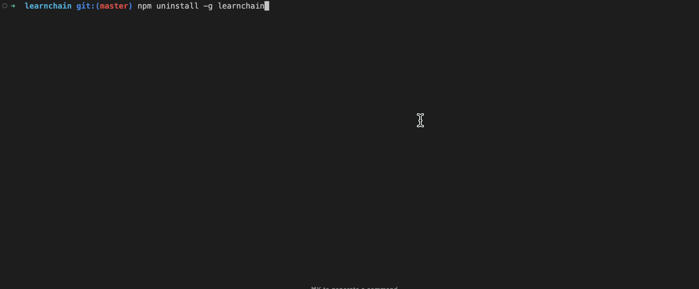

# LearnChain

[](https://opensource.org/licenses/MIT)

**LearnChain** is a terminal-based learning tool that helps you learn to code while using generative AI to build projects. It analyzes your Codex or Claude session logs and surfaces interactive quizzes in a beautiful terminal UI, reinforcing concepts as you work.



## Features

- **Session Log Analysis**: Parse and learn from your AI-assisted coding sessions
- **Quiz Generation**: AI-powered quiz creation based on your actual coding patterns
- **Configuration Management**: Persistent settings stored in `config/app_config.toml`
- **Multi-platform Support**: Distributed via npm for easy installation across platforms
- **Interactive TUI**: Built with [Ratatui](https://ratatui.rs) for a polished terminal experience

## Quick Start
```bash
npm install -g learnchain
```
#### Two options to set API Key:
Option 1: 
Start learnchain with 
```bash
learnchain
```
Then, 
```bash
"Configure details" -> "OpenAI API key:" -> (set your api key here) -> Enter -> m (menu)
```

Option 2:
```bash
learnchain --set-openai-key <key>
```

## Installation From Source

```bash
git clone https://github.com/normand1/learnchain
cd learnchain
cargo build
cargo run
```

## Development

### Prerequisites

- Rust
- Node.js >= 16 (for npm distribution)
- Cargo

### Build Commands

```bash
# Compile the TUI
cargo build

# Run the application
cargo run

# Run tests with output
cargo test -- --nocapture

# Format and lint
cargo fmt
cargo clippy --all-targets --all-features

# Build release binary for npm distribution
npm run build
```

### Project Structure

```
learnchain/
├── src/
│   ├── main.rs              # Entry point and app state
│   ├── ai_manager.rs        # AI/LLM integration
│   ├── config.rs            # Configuration management
│   ├── session_manager.rs   # AI coding tool (Claude/Codex) log processing
│   ├── ui_renderer.rs       # Terminal UI rendering
│   └── view_managers/       # View-specific logic
├── config/                  # Runtime configuration
├── test_fixtures/           # Test fixtures
├── scripts/                 # Build and install helpers
└── dist/                    # npm distribution files
```

See [AGENTS.md](AGENTS.md) for detailed development guidelines.

## Configuration

LearnChain stores configuration in `config/app_config.toml`. Key settings include:

- OpenAI API key (required for quiz generation)
- Default session log paths
- UI preferences

## Contributing

Contributions are welcome! Please:

1. Fork the repository
2. Create a feature branch (`git checkout -b feature/amazing-feature`)
3. Commit your changes (`git commit -m 'Add amazing feature'`)
4. Push to the branch (`git push origin feature/amazing-feature`)
5. Open a Pull Request

See [AGENTS.md](AGENTS.md) for coding standards and testing guidelines.

## License

Copyright (c) Dave Norman <david.norman.w@gmail.com>

This project is licensed under the MIT License - see the [LICENSE](LICENSE) file for details.

## Acknowledgments

- Built with [Ratatui](https://ratatui.rs) - Rust TUI framework
