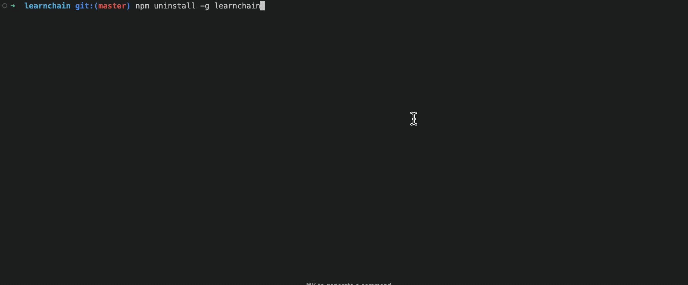

# LearnChain

[](https://opensource.org/licenses/MIT)

**LearnChain** is a terminal-based learning tool that turns your AI-assisted coding sessions into quizzes you can review inside a Ratatui interface. It reads session history from Codex CLI or Claude Code, summarizes the work, generates structured lessons with a Rig-backed LLM pipeline, and tracks what you have learned over time.



## Features

- Parse coding sessions from both Codex CLI and Claude Code
- Generate structured quizzes from your recent or selected historical sessions
- Support multiple LLM providers: OpenAI, Anthropic, and OpenRouter
- Use [Rig](https://github.com/0xPlaygrounds/rig) for provider integration and structured output generation
- Review lessons in an interactive terminal UI with quiz navigation and summaries
- Track learning history and first-attempt accuracy in a local SQLite database
- Browse an analytics dashboard for recent learning activity
- Persist configuration in `config/app_config.toml`
- Enable per-run debug logging with `--debug`

## Quick Start

### Install from npm

```bash
npm install -g learnchain
```

### Run from source

```bash
git clone https://github.com/normand1/learnchain
cd learnchain
cargo build
cargo run
```

## Configure an LLM provider

LearnChain can generate quizzes with OpenAI, Anthropic, or OpenRouter. Provider selection, model selection, and API keys are managed in the in-app Config view.

### Option 1: configure inside the TUI

1. Start LearnChain.
2. Open `Configure details`.
3. Choose the provider you want to use.
4. Set the provider-specific model or API key fields.
5. Save and return to the menu.

### Option 2: configure keys from the CLI

```bash
learnchain --set-openai-key <key>
learnchain --set-anthropic-key <key>
learnchain --set-openrouter-key <key>
```

You can also clear them:

```bash
learnchain --clear-openai-key
learnchain --clear-anthropic-key
learnchain --clear-openrouter-key
```

## Usage

The main menu currently supports these core flows:

- Generate a learning response from your latest session activity
- Select a historical session, grouped by project, and generate a quiz from it
- Open the analytics dashboard
- Configure provider, model, and app defaults

Generated lessons can be written to `output/` when `Write artifacts to output` is enabled in the Config view. Learning history is stored in `output/learning_history.sqlite`.

## Debug Logging

To troubleshoot runtime issues, start the app with the debug flag:

```bash
cargo run -- --debug
```

If you are running the installed binary directly:

```bash
learnchain --debug
```

This forces the app to write debug logs to:

```text
output/learnchain-debug.log
```

The log file is truncated at the start of each debug run so each session starts with a clean log.

## Development

### Prerequisites

- Rust
- Node.js >= 16 for npm distribution tasks
- Cargo

### Common commands

```bash
# Build the TUI
cargo build

# Run the application
cargo run

# Run with runtime debug logging
cargo run -- --debug

# Run tests with output
cargo test -- --nocapture

# Format and lint
cargo fmt
cargo clippy --all-targets --all-features

# Build the npm distribution
npm run build
```

## Project Structure

```text
learnchain/
├── src/
│   ├── main.rs              # Entry point, app state, CLI handling
│   ├── config.rs            # Configuration and provider/model resolution
│   ├── llm/                 # Rig-backed learning generation
│   │   ├── mod.rs           # App-facing orchestration and background task handling
│   │   ├── backend.rs       # Rig provider clients and structured generation
│   │   └── types.rs         # Structured quiz payloads and usage types
│   ├── knowledge_store.rs   # SQLite-backed learning history and analytics
│   ├── session_manager.rs   # Session orchestration and loading
│   ├── session_sources/     # Session source implementations
│   │   ├── mod.rs           # Shared session traits and types
│   │   ├── codex.rs         # Codex CLI parsing
│   │   └── claude.rs        # Claude Code parsing
│   ├── ui_renderer.rs       # Terminal UI rendering
│   ├── log_util.rs          # Debug logging support
│   └── view_managers/       # View-specific interaction logic
├── config/                  # Runtime configuration
├── output/                  # Optional generated artifacts, logs, and SQLite data
├── test_fixtures/           # Test fixtures
├── scripts/                 # Build and install helpers
└── dist/                    # npm distribution files
```

See [AGENTS.md](AGENTS.md) for repository-specific development guidelines.

## Configuration

LearnChain stores settings in `config/app_config.toml`. Relevant settings include:

- session source selection
- default event sampling and quiz sizing
- active LLM provider
- provider-specific model and API key fields
- whether output artifacts should be persisted to disk

## Contributing

Contributions are welcome. Before opening a PR:

1. Run `cargo fmt`
2. Run `cargo clippy --all-targets --all-features`
3. Run `cargo test -- --nocapture`
4. Note any UI changes, config changes, or risky behavior changes in the PR description

See [AGENTS.md](AGENTS.md) for coding standards and testing guidelines.

## License

Copyright (c) Dave Norman <david.norman.w@gmail.com>

This project is licensed under the MIT License. See [LICENSE](LICENSE) for details.

## Acknowledgments

- Built with [Ratatui](https://ratatui.rs)
- LLM integration powered by [Rig](https://github.com/0xPlaygrounds/rig)
